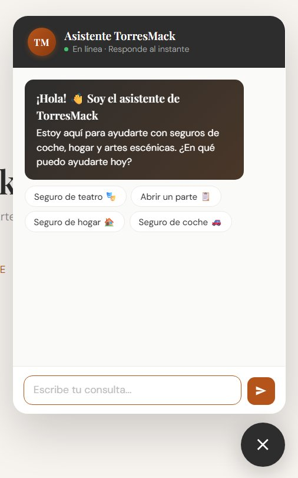

# TorresMack · Asistente de Seguros 🎭


Asistente virtual de atención al cliente para **TorresMack Correduría de Seguros**.
Responde dudas sobre seguros de **coche**, **hogar** y **artes escénicas** usando RAG con documentos reales de la correduría, y deriva al agente humano cuando la consulta lo requiere.

---

## Demo

[](https://www.loom.com/share/9b2b2156e3f14c96b17b8ad522950e1e)

▶️ [Ver demo en vivo](https://www.loom.com/share/9b2b2156e3f14c96b17b8ad522950e1e) — widget flotante respondiendo con información real de las pólizas.

---

## Tecnologías

| Capa | Tecnología |
|---|---|
| Backend | FastAPI · Uvicorn · Python 3.13 |
| RAG | ChromaDB · sentence-transformers (`paraphrase-multilingual-MiniLM-L12-v2`) |
| Modelo | DeepSeek-V4-Flash vía Azure AI Foundry |
| UI | HTML/JS widget flotante · Gradio (alternativa) |
| Tests | pytest |
| Logs | JSONL por llamada (tokens, latencia, request_id) |

---

## Arquitectura

```
Usuario (widget flotante)
        ↓
POST /predict  (FastAPI)
        ↓
RAG — ChromaDB + sentence-transformers
(recupera fragmentos relevantes de los documentos)
        ↓
DeepSeek-V4-Flash  (Azure AI Foundry)
        ↓
Respuesta  +  logs.jsonl
```

---

## Estructura del proyecto

```
torresmack-asistente/
├── backend/
│   ├── main.py              # API FastAPI con POST /predict
│   ├── rag.py               # Módulo RAG (ChromaDB + embeddings)
│   ├── requirements.txt
│   └── .env.example         # Plantilla de variables de entorno
├── ui/
│   ├── index.html           # Widget de chat flotante
│   ├── app.py               # Interfaz Gradio (alternativa)
│   └── requirements.txt
├── tests/
│   ├── smoke.jsonl          # 25 casos de prueba
│   └── test_smoke.py        # Suite de tests con pytest
├── data/                    # Documentos indexados por RAG
│   ├── artes_escenicas.txt
│   ├── siniestros_coche.txt
│   └── siniestros_hogar.txt
├── LICENSE
├── .gitignore
└── README.md
```

---

## Instalación

### 1. Clona el repositorio

```bash
git clone https://github.com/GuilermoT/torresmack-asistente.git
cd torresmack-asistente
```

### 2. Instala dependencias del backend

```bash
cd backend
pip install -r requirements.txt
```

### 3. Instala dependencias de la UI

```bash
cd ../ui
pip install -r requirements.txt
```

### 4. Configura las variables de entorno

```bash
cp backend/.env.example backend/.env
# Edita backend/.env con tus credenciales
```

---

## Variables de entorno

| Variable | Descripción | Requerida |
|---|---|---|
| `LLM_PROVIDER` | `mock` o `foundry` | No (default: mock) |
| `AZURE_OPENAI_ENDPOINT` | URL del recurso Azure AI Foundry | Solo con foundry |
| `AZURE_OPENAI_BASE_URL` | URL base para las llamadas al modelo | Solo con foundry |
| `AZURE_OPENAI_DEPLOYMENT_NAME` | Nombre del deployment (`DeepSeek-V4-Flash`) | Solo con foundry |
| `AZURE_OPENAI_API_KEY` | Clave de API de Azure | Solo con foundry |
| `GROUP_ID` | Identificador del grupo para logs | No |

> ⚠️ Nunca subas el `.env` al repositorio — está excluido en `.gitignore`

---

## Ejecución

### Lanzar el backend (terminal 1)

```bash
cd backend
uvicorn main:app --reload --port 8000
```

La primera vez descarga el modelo de embeddings (~470MB). Verás:
```
[RAG] Índice listo — 165 fragmentos desde .../data
```

Disponible en: http://localhost:8000  
Documentación: http://localhost:8000/docs

### Lanzar la UI — widget flotante (recomendado)

Abre `ui/index.html` directamente en el navegador con doble clic.

### Lanzar la UI — Gradio (alternativa)

```bash
cd ui
python app.py
```

Disponible en: http://localhost:7860

---

## Ejecutar los tests

Con el backend corriendo en otra terminal:

```bash
pytest tests/test_smoke.py -v
```

**Resultado esperado:** 55 passed (25 casos × 2 tests + 5 tests adicionales)

---

## Contrato de la API

### POST /predict

**Request:**
```json
{
  "input": "¿Qué cubre el seguro de hogar?",
  "history": [],
  "options": { "temperature": 0.2, "max_tokens": 600 }
}
```

**Response OK:**
```json
{
  "ok": true,
  "output": "El seguro de hogar cubre daños por agua, incendio...",
  "meta": {
    "provider": "foundry",
    "deployment": "DeepSeek-V4-Flash",
    "latency_ms": 3686,
    "prompt_tokens": 104,
    "completion_tokens": 140,
    "total_tokens": 244,
    "request_id": "uuid...",
    "rag_chunks": 3
  }
}
```

**Response ERROR:**
```json
{
  "ok": false,
  "error": {
    "code": "INVALID_INPUT",
    "message": "El mensaje no puede estar vacío.",
    "details": { "field": "input" }
  }
}
```

### GET /health

```json
{
  "status": "ok",
  "provider": "foundry",
  "deployment": "DeepSeek-V4-Flash",
  "timeout_s": 15,
  "max_tokens": 600
}
```

---

## Logs

Cada llamada al modelo se registra en `backend/logs.jsonl`:

```json
{
  "ts": "2026-06-07T13:44:00+0200",
  "group_id": "G5",
  "request_id": "uuid...",
  "deployment": "DeepSeek-V4-Flash",
  "prompt_tokens": 528,
  "completion_tokens": 173,
  "total_tokens": 701,
  "latency_ms": 2363
}
```

**Ver los logs:**
```bash
# Windows
Get-Content backend/logs.jsonl

# Mac/Linux
cat backend/logs.jsonl
```

---

## Métricas de rendimiento

Medidas sobre **39 llamadas reales** a DeepSeek-V4-Flash:

| Métrica | Valor |
|---|---|
| p50 (mediana) | 2.363 ms |
| p95 | 8.543 ms |
| Mínimo | 1.033 ms |
| Máximo | 18.173 ms |

## Estimación de coste

| Parámetro | Valor |
|---|---|
| Tokens medios por request | 651 tokens |
| Precio por token | 0,0003 € por token |
| Coste por request (media) | 651 × 0,0003 € = 0,1953 € |
| **Coste estimado por 1k requests** | **≈ 195,3 €** |

> Nota: precio calculado con supuesto académico de 0,0003€/token. En producción real con DeepSeek-V4-Flash los precios de mercado son significativamente menores.

---

## Casos de prueba

| # | Input | Tipo | Tema |
|---|-------|------|------|
| 01 | ¿Qué cubre el seguro a todo riesgo? | Resolver | Coche |
| 02 | Se me ha roto una tubería, ¿qué hago? | Resolver | Hogar |
| 03 | ¿Qué seguro necesita una compañía de teatro para una gira? | Resolver | Artes |
| 04 | ¿Cuál es la diferencia entre seguro para propietario e inquilino? | Resolver | Hogar |
| 05 | ¿Está cubierto un técnico de sonido si se lesiona? | Resolver | Artes |
| 06 | Me han robado el coche, ¿qué pasos tengo que seguir? | Resolver | Coche |
| 07 | ¿El seguro cubre los daños al material escénico en transporte? | Resolver | Artes |
| 08 | ¿Qué es la responsabilidad civil y para qué sirve? | Resolver | General |
| 09 | Quiero contratar una póliza, ¿cuánto cuesta? | Derivar | General |
| 10 | ¿Ofrecéis seguro de vida o de salud? | Fuera de scope | General |
| 11 | ¿Cómo abro un parte de coche con Mapfre? | Resolver | Coche |
| 12 | ¿Cuánto tiempo tengo para comunicar un siniestro de hogar? | Resolver | Hogar |
| 13 | ¿Qué suma asegurada tiene la póliza de RC para teatro? | Resolver | Artes |
| 14 | ¿El seguro de hogar cubre el robo dentro de casa? | Resolver | Hogar |
| 15 | ¿Trabajáis con alguna aseguradora en concreto? | Resolver | General |
| 16 | ¿La póliza de artes escénicas cubre el local de ensayo? | Resolver | Artes |
| 17 | Tengo un accidente de coche, ¿qué documentación necesito? | Resolver | Coche |
| 18 | ¿El seguro cubre si un espectador se lesiona en una función? | Resolver | Artes |
| 19 | ¿Puedo contratar el seguro de teatro online? | Derivar | Artes |
| 20 | ¿Qué es una franquicia en un seguro? | Resolver | General |
| 21 | ¿El seguro de hogar cubre daños por inundación? | Resolver | Hogar |
| 22 | Hola, buenos días | Resolver | General |
| 23 | ¿Cuándo se renueva la póliza de artes escénicas? | Resolver | Artes |
| 24 | ¿Hacéis seguros para grupos de teatro aficionados? | Resolver | Artes |
| 25 | ¿Puedo cancelar mi póliza cuando quiera? | Resolver | General |

---

## Licencia

MIT © Guillermo Torres Lamas